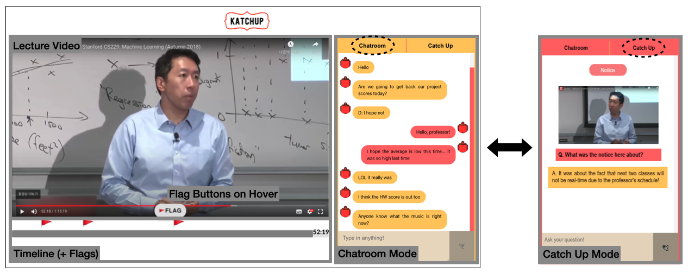
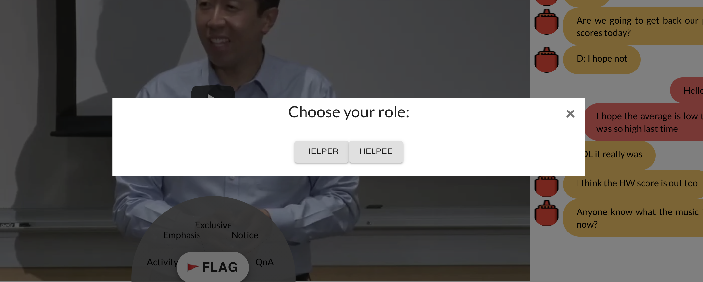
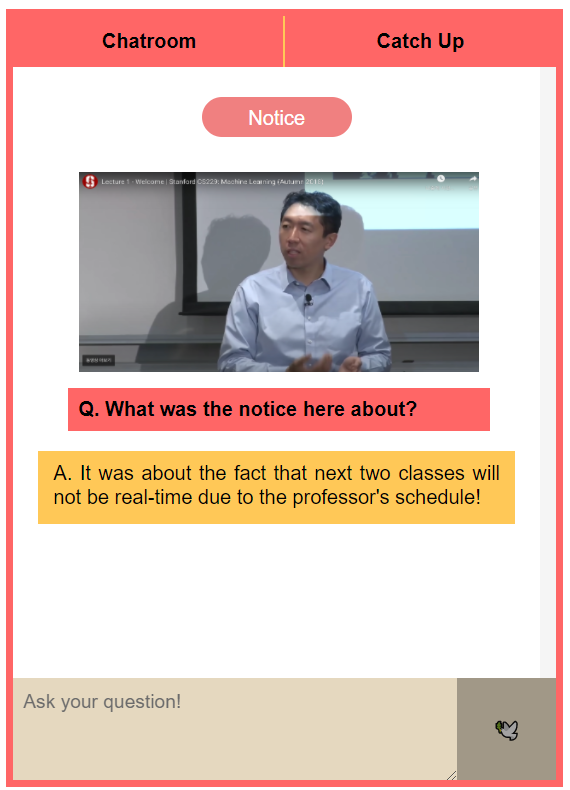

# DP4 - High-Fi Prototype

Team Name: MinCho Avengers 
Team Members: Mina Huh, Juhoon Lee, Jeongeon Park
  2020 Fall, CS473 Intro to Social Computing KAIST

-----
### Project Summary

In real-time online lectures, students who are late or lose track have difficulties understanding the content as lectures often incorporate materials exclusive to the live lecture. To help catch up on missed information unavailable in lecture materials, KatchUp supports crowd-generated timeline and context-based QnA between peers. Users can immediately identify the missed content by looking at crowd-generated flags and quickly ask questions with the help of KatchUp-generated screenshots and questions.

### Instruction
#### Interface

* Lecture Video
* Flag Buttons
* Timeline & Flags
* Chat
* Catup Mode

#### Choosing Your Role
Select your role as Helper or Helpee. The former will watch the lecture from the beginning, and the latter will watch the lecture midway (~15 minutes). **This function simulates being late and will not be part of the actual system.**

==**Disclaimer:** all functions can be used regardless of the role you choose.==

#### Helper
* When you **hover** over the floating "Flag" button near the bottom of the video, a button list of possible flag types appears. 

* Click on one of the flag types you think is appropriate for the current time. Button clicks from multiple users will be aggregated to place the flag on the timeline. 

* You can click on a flag on the timeline, which opens up the Catch Up mode on the right. If there are questions on the Catch Up mode, you can choose to answer.

#### Helpee
* When you click on a flag on the timeline, the Catch Up mode opens on the right, and a screenshot of the lecture at the time corresponding to the flag will be shown.
* You can post the default question (e.g. Notice: What was the notice about?) or type the question you want.

### Prototype
#### Prototype URL: https://minchoom-cs473.web.app/
> Using chrome is recommended.
#### Git Repository URL: https://github.com/jeongeonp/MinChoAvengers

#### Libraries and Frameworks: ReactJS, Semantic UI, Material-UI, Firebase

### Individual Reflections

#### Mina Huh
* Which part of the system did you directly contribute to?
    * I contributed by setting up the overall structure of the web app (frontend) and implementing video player and flag aggregation. By dividing the implementation task into component-level tasks, work division was facilitated.
* What were some of the difficulties you faced?
    * While merging the code that individual has implemented, the size and ratio of the UI didn't show up as intended as we all had different monitor size. 
* List one useful skill you learned while working on the high-fi prototype.
    * I learned to build a responsive web app. Also, I learned how to save and retrieve data efficiently using Firebase which doesn't support relations.

#### Juhoon Lee
* Which part of the system did you directly contribute to?
    * I contributed to implementing the chat and the Catch Up mode of the system. I designed the front-end of the chatting system, and connected it to the established database in Firebase.
* What were some of the difficulties you faced?
    * It was a tremendous effort to constantly update the database as the Catch Up mode and the chat changed. Because the database structure was so complex, there were many things to take care of. Also, rather than borrowing a UI, I made the css nearly from scratch, which was also a headache.
* List one useful skill you learned while working on the high-fi prototype.
    * I learned how to efficiently manage the connection between the front-end and the database. It was difficult but fun to figure out how to create a scheme that was efficient, well-organized, and aestheically pleasing while combining different components together to form one unified working system.

#### Jeongeon Park
* Which part of the system did you directly contribute to?
    * I set up the overall structure of the Firebase, and helped in connecting the front-end components to the database. I also looked for appropriate icons for the flags as well as the logo of the system. 
* What were some of the difficulties you faced?
    * To build the overall structure of the database, I had to think about the system in a high level and think about how each component might interact with each other. As it was my first time building the structure of the database, I had difficulties considering all possible functions, as well as coming up with a good database structure for chatrooms.
* List one useful skill you learned while working on the high-fi prototype.
    * I learned the importance of planning before coding, which was something I have never done before. Writing down all the necessary components and functions helped me understand the overall picture of the system, which made it easier to set up the database structure.
