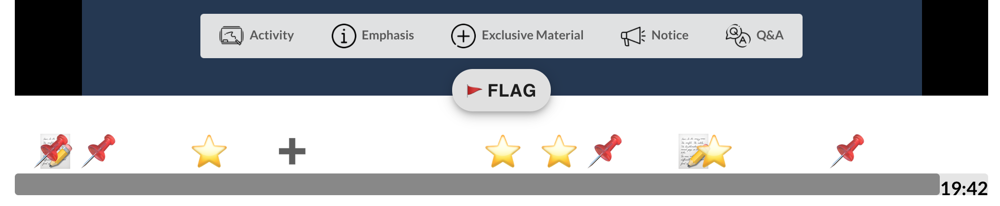
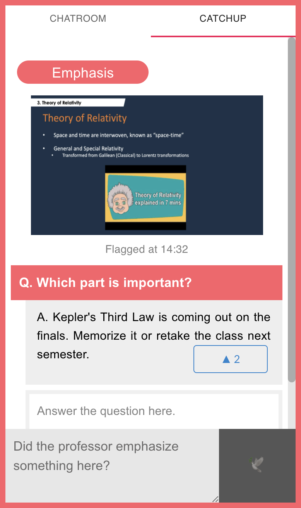
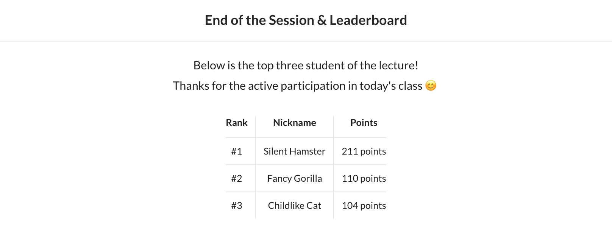
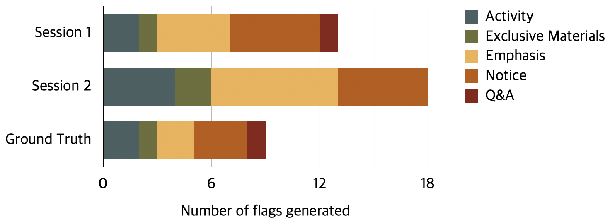
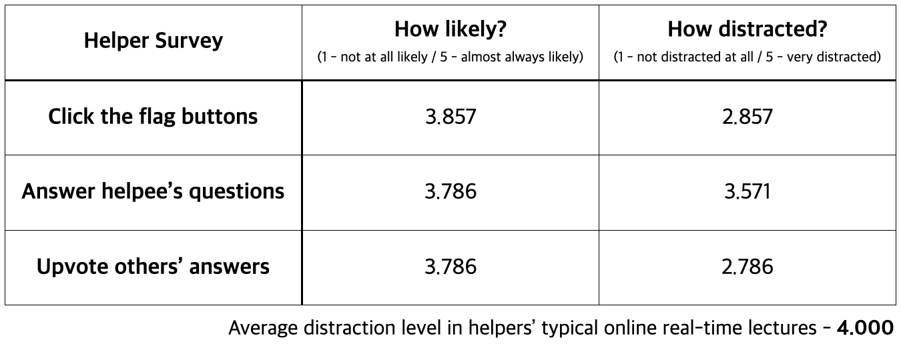
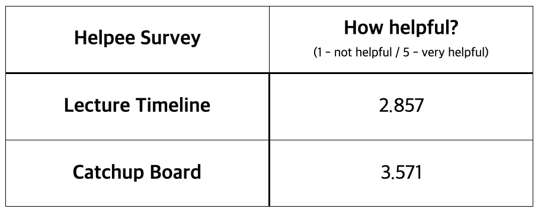

# DP6 - Final Report

2020 Fall, CS473 Intro to Social Computing  
Team Name: Mincho Avengers  
Team Members: Mina Huh, Juhoon Lee, Jeongeon Park  

**Link to Video**: https://youtu.be/6Rjd_sDGK3U 
**Link to Prototype**: http://minchoom-cs473.web.app 
**Link to Github**: https://github.com/jeongeonp/MinChoAvengers

-----

## System Name: KatchUp

A Lightweight Lecture Catch Up System for Latecomers

## Representative Screenshots
#### Annotated Overall Interface

*The overall interface with components in blue border. Catchup Board and Chatroom can be switched as tabs.*

#### Lecture Timeline

*The crowd-generated lecture timeline with five different flags. The flag button clicked by the helpers are aggregated.*

#### Catchup Board

*At each flag of the lecture timeline, a Catchup board with the flag information is generated. Here, helpees can ask questions and helpers can either answer the questions or upvote others' answers.*

#### Leaderboard at the End

*The leaderboard that is shown to everyone at the end of the lecture. Clicking flag buttons, answering the questions, and upvoting the answers counts towards participation points.*

## Quality Arguments

The greatest strength of KatchUp is its ***compactness and simplicity***. By having everything on one screen, the user has no fear-of-missing-out (FOMO) or risks wasting time by clicking on multiple tabs. Rather than having a multitude of complex features, KatchUp focuses on crucial tasks that are intuitive and easy to use. All features use only one or two clicks in achieving what the user wants. Flags are a simple hover and a click; question and answering both requires a click for a flag and typing in a question/answer; and upvoting is just two clicks. No task takes more than 10 seconds, provided that the user knows what they want to ask or answer. 

​													*(A sample image of clicking on the Emphasis flag)*

And therein lies the crux of the system: KatchUp uses a ***context-driven*** question and answering architecture that allows users to know exactly what they want to ask or answer in an instant, rather than wasting time on analyzing the content or finding the answer among the massive number of slides. The Catchup board gives the type of the content, time flagged, and the screenshot for each flag, delivering the most crucial information to the user immediately. This feature is fortified by providing questions that are likely to be asked again and again as hint texts that can be asked by the user right away for each flag type. Users especially liked the screenshots provided by the board.

​													*(The three information in the Catchup board)*

KatchUp differentiates itself from other education and Q&A platforms by focusing specifically ***on content not available in the provided lecture materials***. The five flag types (Activity, External Materials, Emphasis, Notice, and Q&A) target the most common topics that latecomers worry missing out on without access to after the lecture. A user commented, “I was relieved that I wouldn’t be missing out on important notices or points.” The emphasis flag especially was popular among the users as a great indicator of content importance.

​																*(The five different types of flag)*

The system is self-driven by students who motivate and are motivated by each other without requiring regulators such as TAs or professors. In an online learning environment, KatchUp's ability to promote mutual and interactive education is advantageous and promising.

Many test users also expressed their enjoyment of an unintended effect where “[they] would be reminded of the lecture content thanks to the flags or while answering questions.”  It demonstrates the flexibility and well-roundedness of KatchUp where all users, regardless of their role, enjoy the benefits of the system.

Finally, the UI matches the theme of intuitive design. The colors carry a visual uniformity in conveying the purpose of a feature. Specifically, a function that the requests help is the iconic red color (Catch Up, questions), while a function that helps others is gray (flag buttons, timeline, answers). 

KatchUp is a complete system with a straightforward design and a focused mission that provides students with the custom tools they need to catch up and stay caught up in a near-complete online education environment. 

## Evaluation

We ran two real-time sessions with 21 participants (9 in session 1, 11 in session 2) recruited through school communities. We randomly assigned the participants to the helper or the helpee role, resulting in 14 helpers and 7 helpees. 

Majority (66.7%) of the participants are taking 1 to 3 real-time courses at the moment, and 5 are taking more than 4 real-time courses. All participants except one have been late to courses, and the most common way of catching up with missed contents was by asking friends using messengers (n=13), followed by not catching up (n=5).

Each session took about 40 minutes - 5 minutes on system introduction, 5 minutes on role and task explanation, 20 minutes on using the system, and 5 minutes filling out the survey. The lecture in the system was pre-recorded, but the participants began watching the lecture at the same time to simulate a real-time online lecture (helpees coming in 10 minutes late).

In two sessions, participants clicked 156 flags, which was aggregated to 31 flags. Detailed distribution is shown below. A total of 24 questions were asked in 16 flags, of which 22 were answered. The unanswered 2 questions were asked 3 and 5 seconds before the end of the lecture, where we assume that most helpers did not see the question at all. 51 answers were posted to answer those questions, and got 65 upvotes in total.

*(Figure - The number of flags generated in the two sessions and the ground truth. The ground truth was determined by our expectation of the number of flags in the recorded lecture.)*

For helpers, the average number of flags and answers added was 8.36 and 3.29, respectively. The level of likelihood and the distraction are shown in table 1. For helpees, the average number of questions asked and flag buttons clicked was 2.14 and 4.14, respectively. The level of helpfulness is shown in table 2. 

​						*(Table 1 - The helpers' level of likelihood and distraction of using different functions.)*

​									*(Table 2 - The helpees' level of helpfulness using different functions.)*

We also asked the participants’ favorite feature in the survey, and the most liked feature was the flags (n=10), some participants specifically enjoying Emphasis (n=3) and Notice flags (n=2). The second favorite feature was the Catchup board, where one participant said that the board can be a distraction, but sometimes [they] need those refreshers to follow the class.

Some usability issues were also reported. The most common issue was overlapping flags, participants suggesting that smaller icons or better hovering may help.

Nonetheless, we were able to observe some interesting points. The distribution of the act of helping others was very different between answers and flags. Only a small number of helpers actively answered the questions on the Catchup board (average: 3.29, std: 2.23), while the number of flags clicked had a more even distribution. (average: 8.36, std: 2.21). We believe that this occurred as the level of distraction to the helpers is higher in answering questions (3.571) compared to clicking flag buttons (2.857).

Another point was that there were on average 5.03 flag button clicks for a flag to be generated. Our threshold for generating the flags were 2 flag button clicks, but looking at the distribution, we may set a higher threshold, according to the number of helpers.

## Discussion
Our prototype, KatchUp supports light and context-aware catch up for latecomers in real-time online lectures. From our user study with the mimicked setting of real lectures, we distilled below discussion points. 

**1. Motivation toward participation**
From the user study and the post-survey, we discovered a tendency toward active participation. For flag generation, average likelihood to participate was 77.14% and for question answering, students were 75.71% likely to help others. As the solution of our system highly depends on the active exchange of information between students, the timeliness and the reliability are the keys for successful interactions. 

We believe that observed active participation is due to 1) visibility of one’s contribution shown as the leaderboard format at the end of every lecture, and 2) benefit of being able to self-remind the important parts by helping others. Our system uses anonymous mode during the lecture time and reveal the list of top scorers (most helpful peers) only at the end, it can minimize the anxiety of asking questions and giving wrong answers while still encouraging contributions. Also, while not an anticipated behavior, we also discovered that helpers themselves enjoyed marking and answering catchup questions which could be used as a summary for their own good in the future. We noticed 3 participants(among 14 helpers) posting question and answering oneself for such purpose.

**2. Controllable and uncontrollable factors**
For control of quality, we mainly used two approaches: flag aggregation and upvoting system for answers. When compared with ground truth flags created by experimenters, aggregated flags created in the user study  gave reasonably high accuracy, proving that our approach to merge and show only those marked by majority of helpers worked well. However, when looked at the Catchup board, we discovered some behaviors of giving obviously wrong answers in the attempt to make jokes. For example, when a helpee asked “What is important thing? Hello?” in an Emphasis flag, helpers replied in a thread with lyrics from Adele’s song Hello. 

We believe these were able to be censored using upvoting system, and will further decrease in real lecture setting, where individual student care more about their reputations. Still, these trolling behaviors, while not a majority, hindered timely catch up because any answer posted to a question marks the question as “resolved” thereby reducing attention in the future. 

Thus, we concluded that introducing other policies, such as unrevealing the answer until a question gets multiple answers should be adopted to reduce the effect of trolling and response order bias. Also, introducing more reaction option than just using upvote might add richer representation of the answer quality. For example, adding both 😂 button and ✔️can help students distinguish answers that make jokes from those that are helpful.  

## Individual Reflection
* **Mina Huh**
    * In the implementation, I contributed to setting up the overall structure of the web app (frontend) and  implementing video  player and flag aggregation. Specifically, I divided the implementation task into component-level tasks so that work division can be facilitated. After the high-fi prototype was deployed, we discovered further bugs when the system was used by multiple participants. As errors in the system can hinder further analysis, I tested the reliability of the system with various edge cases. By collecting reported bugs and then fixing, participants reported no functional bugs during the user study. 
    * Throughout the semester, we had great teamwork especially in sharing opinions. For every milestone, we started by having an open ended meeting at first, where we brainstormed ideas without any hurdle in mind. Then we ourselves set criteria for choosing each option, such as creativity, generalizability, as well as our ability to implement within given time. The best part of our teamwork is that even not during deadlines we kept having light and frequent checkups by sharing related works and inspiring pre-existing systems used for lecture summarization. The most difficult time for our team was during the High-fi prototype deadline, during when our team members changed. As we had much to do with less members in short time, remaining three members had to work harder to meet the deadline with the prototype of reasonable quality. From this experience, we learned that sometimes things don’t go as planned and thus it is important to come up with timely, sub-optimal solution.
    * From the design project, I learned the power of quality control when deploying the system in the real world. Before, I used to assume that all users will behave as planned but after observing actual trolling behaviors I could understand the need for  controlling the quality for reliable systems. Also, I got more experienced with web programming by building a system supporting  multi users at the same time. By designing and building it from scratch without any template, all members developing skill improved a lot.
    * After engaging in this project, I became more interested in streaming videos and how participants communicate during watching. I would be interested to either continue this project with more generalizability with research perspectives or to get engaged in project with similar problem domain.

* **Juhoon Lee**
    * While the team had active and equal discussions on designing the system, the implementation was divided into clear roles. My contribution was mostly in creating the chatroom and the Catch Up interface. I created separate tabs for the two systems and created a real-time, functional chatroom and Catch Up mode that would appear when clicking on a peer-generated flag. Some of the refining and tweaking of the features (such as randomly generated nicknames) was done by the other team members. In addition, I contributed largely to the UI cleaning of the system, such as adjusting the div sizes and fixing the overall organization. Other minor contributions include hovering implementation for flag buttons and bug fixes.
    * The greatest part of the team was how passionate and knowledgeable the team members were. All members contributed their ideas and gave constructive criticism to an idea to constantly refine the design to be reasonable and better. Members would find studies and other systems that were similar in goal or design to analyze how they could be helpful in developing our system. Thus, the iterations got better and better as time progressed, resulting in what we consider to be a very effective platform for latecomers. Communication was always done openly and respectfully, making sure everyone understood what was happening before moving on. However, this also meant that the group would have very long and sometimes fruitless discussions with a lot of ideas thrown out without anyone pushing hard for a concrete idea. In a way, everyone was almost too respectful of one another, and sometimes were left indecisive on important parts of the project. In addition, the team, myself very much included, wasn’t particularly great about keeping promises and deadlines set forth.
    * I would like to continue working with the same group. Regardless of the members, in a future project, I would make sure that everyone to shares a common vision and would set forth very clearly what the purpose of the system is and how we would achieve it early on in the project. I would also set up more regular meeting dates and deadlines to check on the progress of each member and regularize meeting at certain times.
    * I realized through the project that social computing involves not just the users, but an active interaction between the users, developers, and other communities. Also, I learned that unintended consequences, good or bad, cannot be realized until proper testing is done. In designing the GUI for the system, it is crucial to consider that what the user needs isn't evident immediately to the creator.

* **Jeongeon Park**
      * The team did not split the system so that one person only focuses on one thing, thus I was able to implement parts of every feature. As written in the DP4 report, I designed the database of the system and connected the database to the frontend, as well as set the deployment script. In the front-end, I connected the lecture timeline and the Catchup board when flags were clicked, showed the correct questions and answers for each flag in the Catchup board, sent alerts to the helpee when their questions were answered, and implemented the participation point logic. I also implemented the first and the last part of the system - the tutorial with the login function and the randomly generated nickname, as well as the leaderboard at the end of each session. When there were bugs, the team listed all the bugs and took parts almost equally.
      * I was very fortunate to meet team members that had great ideas and were active about sharing them, as well as listened to other peoples’ ideas. When we were deciding the project topic, I remember everyone bringing 5 to 10 ideas, discussing the pros and cons of each idea, and voting to decide on the topic that everyone liked. What I liked about the team is that we did not just aim to create a system that is fun and enjoyable, but took into consideration the concepts such as quality control, intrinsic motivation, level of distraction, etc. in designing the system. However, since we sometimes cared too much about the project, sometimes while we were discussing, we easily forgot the purpose of the meeting and went onto talking about a very minor thing for a long time - which made the meeting longer and inefficient.
      * The main challenge in the team project began when I had trouble with one of my previous teammates. Since the team lost a member one week before the high-fi prototype deadline, we had to re-organize the implementation roles, and each person had to spend more time. I often felt sorry for my teammates, and at the same time my mood went back and forth during the period. Thankfully, my teammates patiently waited for me and filled in the part that I was unable to do on time, and this made me recover faster.
      * Through the team-based design project experience, I realized how important it is to have a set role for each person. If each person had a particular function, or a position that was assigned to (e.g. front-end), the discussion time can be made shorter as each person knows what they have to do at different steps of the design process. In the social computing aspect, I realized how everyone can have different priorities in building a system. For example, one person would value quality control the most, while the other can value motivation the most. Frequent checkups and discussions on the social computing aspect of the system is necessary in building a good system.
